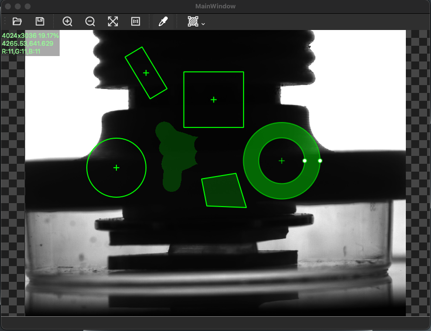

# Image Viewer: Qt based image viewer

## highlights:
- scale(up/down/fit window/1:1)
- pixel picker
- label widgets(exist: rect/polygon, more coming soon. Scale with image but line width is fixed)

## gallery
